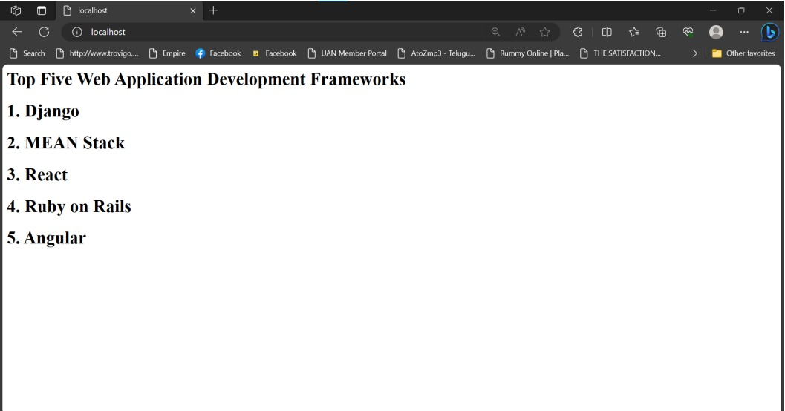

# Developing a Simple Webserver

NAME:K.GOUTHAM

ID:23008975

DEPT:IOT

# AIM:

Develop a webserver to display about top five web application development frameworks.

# DESIGN STEPS:

## Step 1:

HTML content creation is done

## Step 2:

Design of webserver workflow

## Step 3:

Implementation using Python code

## Step 4:

Serving the HTML pages.

## Step 5:

Testing the webserver
# PROGRAM:
```
from http.server import HTTPServer, BaseHTTPRequestHandler

content = """
<html>
<head>
</head>
<body>
<h1>Top Five Web Application Development Frameworks</h1>
<h2>1.Django</h2>
<h3>2.MEAN Stack</h3>
<h4>3.React</h4>
<h5>4.Ruby on Rails</h5>
<h6>5.Angular</h6>
</body>
</html>
"""
```


# OUTPUT:


# RESULT:

The program is executed succesfully.


